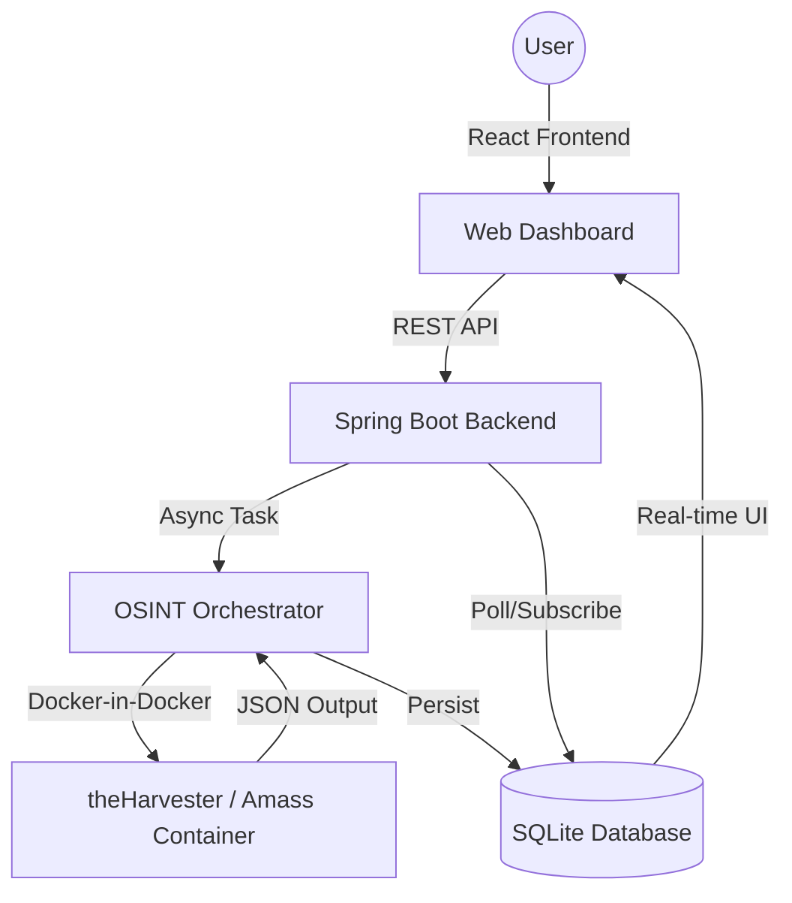
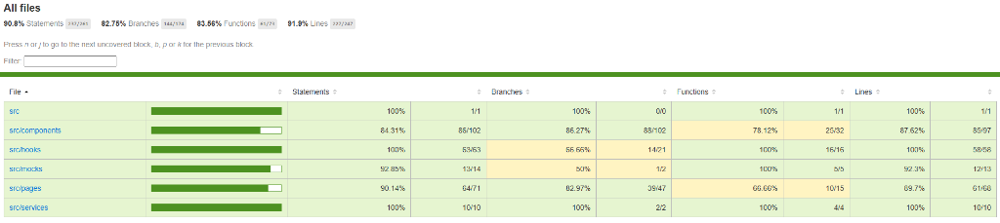
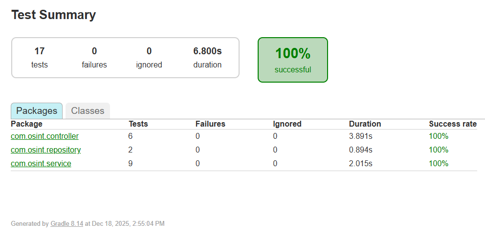

# 🛡️ OSINT Web Application

[](https://kotlinlang.org/)
[](https://spring.io/projects/spring-boot)
[](https://reactjs.org/)
[](https://www.typescriptlang.org/)
[](https://www.docker.com/)


A professional, full-stack OSINT (Open Source Intelligence) orchestration platform. It enables security researchers to perform domain intelligence gathering using industry-standard tools like `theHarvester` and `Amass` through a highly polished, responsive web interface.

---

## 🏗️ Architecture & Technical Stack

The system leverages a modern asynchronous architecture to handle long-running OSINT scans without blocking the user interface.



### 🛠️ Core Technology Rationale
- **Backend (Kotlin/Spring Boot)**: Chosen for its robust type safety and excellent asynchronous support (Coroutines/Async).
- **Frontend (React/TypeScript)**: Leverages a component-based architecture for rich interactivity (Framer Motion) and strict typing for maintainability.
- **Persistence (SQLite)**: Provides local-first, portable, and reliable storage for scan history without the overhead of a full RDBMS.
- **Containerization (Docker)**: Scans are executed in transient, isolated containers to ensure environment consistency and host-level security (sandboxing).

---

## ✨ Premium Features

- **Rich Aesthetics**: A "Dark Mode" first interface featuring glassmorphism, smooth animations, and a responsive CSS grid.
- **Real-time Intelligence**: Automatic status polling and live result parsing for immediate feedback.
- **Persistent Reordering**: Implements a persistent drag-and-drop system for scan history management.
- **Shareable Insights**: Unique URL persistence for every scan, enabling direct access to historical findings.

---

## 🧪 Proven Quality (Testing)

This project prioritizes robustness with a comprehensive CI/CD-ready testing suite.

| Module | Coverage | Technologies |
| :--- | :--- | :--- |
| **Core Logic (Hooks/Services)** | **100%** | Jest, RTL, MSW |
| **API Layer** | **100%** | JUnit 5, MockK, MockMvc |
| **UI Components** | **~90%** | React Testing Library |
| **Overall Project** | **>92%** | Jacoco, Jest-Coverage |

### 🎥 Visual Proof of Quality

| Project Demo | Frontend Coverage | Backend Test Suites |
| :---: | :---: | :---: |
| [](https://www.youtube.com/watch?v=RyXWD9HhyBc) |  |  |

---

## 🛰️ API Specification (Brief)

| Method | Endpoint | Description |
| :--- | :--- | :--- |
| `POST` | `/api/scans` | Initiate a new OSINT scan. |
| `GET` | `/api/scans` | Retrieve all historical scans. |
| `GET` | `/api/scans/{id}` | Fetch detailed results for a specific scan. |
| `DELETE` | `/api/scans` | Clear all scan history. |

---

## 🚀 Getting Started

Quickly orchestrate and start all services using Docker:

```bash
# Clone the repository
git clone https://github.com/albonidrizi/OSINT.git
cd OSINT

# Start production-ready services
docker-compose up --build -d
```

Access the dashboard at **[http://localhost](http://localhost)**. For deeper customization, refer to the [QUICKSTART.md](QUICKSTART.md).

---

## 🛡️ Security Note
All tools are executed in sandboxed containers. No external dependencies are executed directly on the host machine, mitigating risk from third-party scan scripts.

## 📜 License
This project is built for professional evaluation and portfolio purposes.
